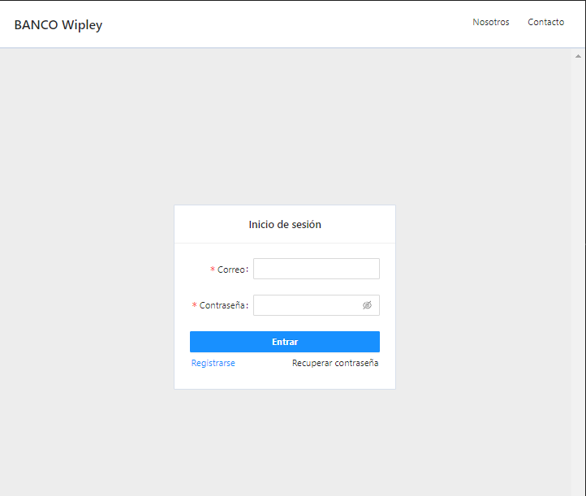
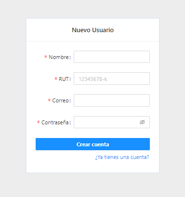
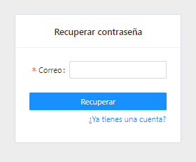
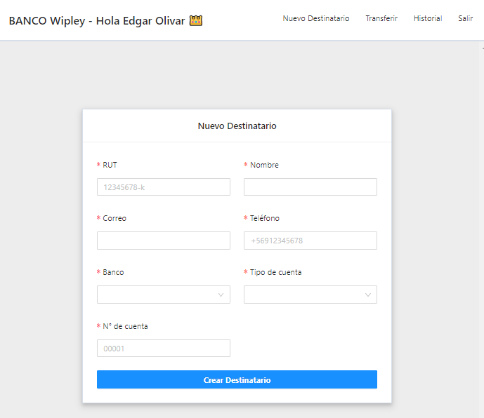
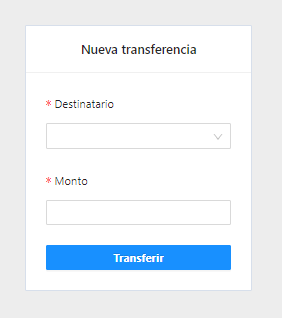
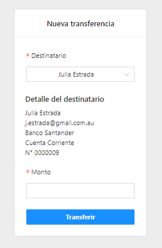
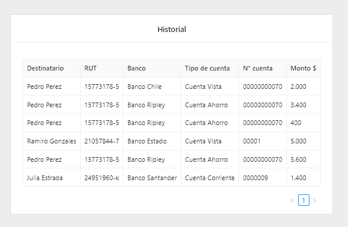

# Bank Wipley!

- Proyecto de prueba con reactjs y el template de typescript, una app con 2 configuraciones de navegación (Auth y Main)
- incluye customs hooks para errores y para consumir una api interna
- usa [Ant Design](https://ant.design/) para react js como libreria de ui 
- usa [React router dom](https://reactrouter.com/) como enrutador

Snaps:
1. Login Screen:

  

2. Register Screen:

  

3. Recovery Screen:

  

4. Destinatary Screen:

  

5. Transfer Screen:

  

6. Transfer Screen selected:

  

7. History Screen:

  

 
 
 
 

Edgar Olivar.